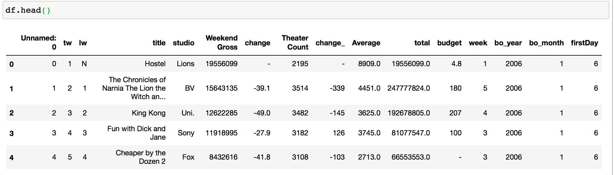

# Sales Prediction

- Weekly movie data **annual_mojo_weekly_full.csv** (including weekend gross): scraped from here https://www.boxofficemojo.com/year/:


- Index reddit data with **Elasticsearch** discussing these movies: from here https://files.pushshift.io/reddit/
   ```
  cd reddit_data
  python create_index.py <index_name>
  ```
 - Download sentiment dictionary for feature extraction, e.g., **Subjectivity Lexicon**: from here http://mpqa.cs.pitt.edu/#subj_lexicon
 - Predict future change in gross income based on discusssions from **Reddit**, see run.py for configuration, e.g.:
   ```   
   from train_rolling import ClassificatorBuilder
   from data_loader import DataMovie, LexiconTokenizer

   #for L2 for the current model
   alpha = 0.01 

   #for L2 for the previous model
   beta = 0.01

   #we have a regression problem, nb_classes = 1
   nb_classes = 1 

   #movie data scraped from here: https://www.boxofficemojo.com/year/
   data_path = "/mounts/work/sedinkina/movies/annual_mojo_weekly_full.csv"
   data = DataMovie(data_path, min_year = 2009, max_year=2018)

   #word list for feature extraction, e.g., Subjectivity Lexicon from http://mpqa.cs.pitt.edu/#subj_lexicon
   opinion_wordlist = "/mounts/data/proj/sedinkina/reddit/subjclueslen1-HLTEMNLP05.tff"
   lexTokenizer = LexiconTokenizer(opinion_wordlist)


   #reddit data from https://files.pushshift.io/reddit/ is indexed using Elasticsearch
   index_name = 'reddit-index'# "day-reddit-index-all"

   cb = ClassificatorBuilder().add_field('data', data)\
                               .add_field('tokenizer', lexTokenizer)\
                               .add_field('index_name', index_name)\
                               .add_field('train_min', 2009)\ #which data for training?
                               .add_field('train_max', 2009)\
                               .add_field('test_min', 2010)\
                               .add_field('test_max', 2010)\ #which data for testing?
                               .add_field('nb_classes', nb_classes)\
                               .add_field('alpha', alpha)\
                               .add_field('beta', beta)\
                               .add_field('rolling', True)\ #apply rolling transfer learning?


   cb.classificator.train_rolling()

   ```
 


